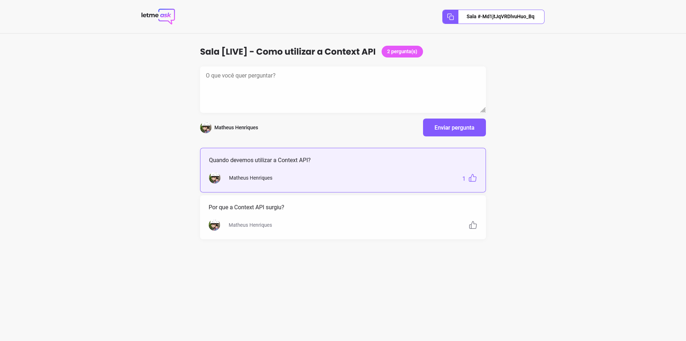

    

# Letmeask - Next Level Week Together

This project is an aplication build in the Next Level Week Together with ReactJS.\
Letmeask help streamers who has multiples questions to anwser, we list the questions and offer features to improve this.

Test yourself 🔥 [letmeask.com](https://letmeask-65812.web.app/)

## 💻 Techs

For this project we use:
- [x] ReactJS with create-react-app template
- [x] Firebase for the social authentication and Realtime Database
- [x] SCSS for the styles
- [x] Typescript

## 🚀 Want to run in your machine?

To run this aplication enter this commands in your terminal:\
`git clone https://github.com/hlgboot/nlw-together-cra.git` - It will clone this repository in your computer.\
`cd nlw-together-cra` - Enter the project folder.\
`yarn` - Install all dependencies.\
`yarn start` - Start developer server in [http://localhost:3000](http://localhost:3000)

## 🔨 Features
This project includes this features to organize questions:
- [x] Send Question - USER
- [x] Like Question - USER
- [x] Start Room - ADMIN
- [x] Highlighted Question - ADMIN
- [x] Check Question - ADMIN
- [x] Remove Question - ADMIN
- [x] End Room - ADMIN
- [x] List Questions by likes and status
- [x] Modal to Close Room and Delete Question
- [ ] Dark Mode - Comming soon                                                                                                                         

##

Build with 💜 by [Matheus Henriques](https://github.com/hlgboot)
